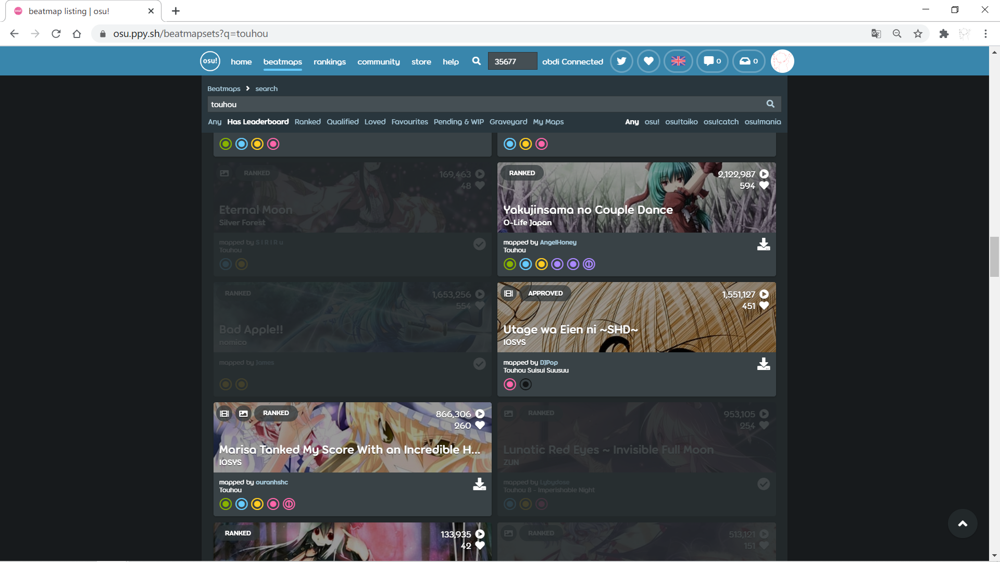

# osu! Beatmap Downloaded Indicator


Indicate if an osu! beatmap in beatmap listing has been installed in the local game.

**osu! lazer is currently unsupported.**

## Screenshot



## Getting started

1. Download and extract the latest DIServer build for your platform in [Releases](https://github.com/karin0/osu-bdi/releases), which will watch for changes of your installed beatmaps.
2. Start the downloaded executable (diserver.exe for Windows builds). If the Songs path is not detected properly (most likely when not in Windows or using a portable version of osu!), click the "Browse.." button and locate the "Songs" directory in your osu! installation manually.
3. Install the userscript from [Greasy Fork](https://greasyfork.org/scripts/407062-osu-beatmap-downloaded-indicator) or [Github](https://raw.githubusercontent.com/karin0/osu-bdi/master/script.js). A userscript manager such as [Tampermonkey](https://github.com/Tampermonkey/tampermonkey) is usually required.
4. Your downloaded beatmap should be dimmed in [beatmap listing](https://osu.ppy.sh/beatmapsets) now. DIServer must be running for this to take effect.

## Build DIServer from source

Depends on `qt5-base`, `qt5-svg` and `qt5-websockets`.
```
git clone https://github.com/karin0/osu-bdi
cd osu-bdi/server
qmake
make
```
